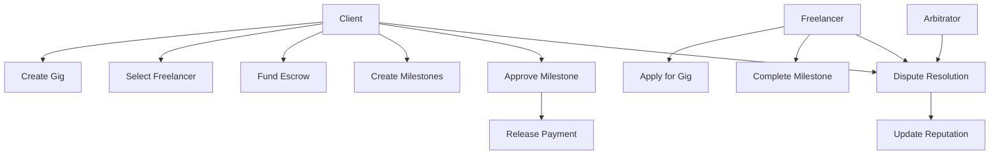

# FlexHive Work Marketplace

A decentralized marketplace connecting freelancers with clients for short-term gigs and flexible work opportunities.

## Overview

FlexHive creates a trustless environment for freelance work by leveraging blockchain technology to eliminate the need for centralized intermediaries. The platform manages the complete workflow including:

- Job posting and discovery
- Application and freelancer selection
- Secure payment escrow
- Milestone-based payments
- Dispute resolution
- Reputation tracking

Key features:
- Smart contract-based escrow system
- Milestone tracking and partial payments
- Built-in dispute resolution with arbitrators
- Reputation system for both clients and freelancers
- Platform fee management
- Evidence-based dispute handling

## Architecture



## Contract Documentation

### Main Components

1. **Gig Management**
   - Create gig listings with requirements and budget
   - Application handling
   - Freelancer selection
   - Status tracking

2. **Payment System**
   - Escrow management
   - Milestone-based payments
   - Platform fee handling
   - Automated payment distribution

3. **Reputation System**
   - Track completed gigs
   - Store ratings
   - Record dispute outcomes
   - Calculate average ratings

4. **Dispute Resolution**
   - Evidence submission
   - Arbitrator management
   - Resolution handling
   - Payment distribution after resolution

### Key Functions

#### For Clients
```clarity
(create-gig (title string-ascii) (description string-utf8) (requirements string-utf8) (budget uint) (deadline uint))
(select-freelancer (gig-id uint) (freelancer principal) (amount uint))
(add-milestone (gig-id uint) (description string-utf8) (amount uint) (deadline uint))
(approve-milestone (gig-id uint) (milestone-id uint))
(complete-gig (gig-id uint) (rating uint))
```

#### For Freelancers
```clarity
(apply-for-gig (gig-id uint) (bid-amount uint) (proposal string-utf8))
(complete-milestone (gig-id uint) (milestone-id uint))
```

#### For Disputes
```clarity
(raise-dispute (gig-id uint) (evidence string-utf8))
(add-dispute-evidence (gig-id uint) (evidence string-utf8))
(resolve-dispute (gig-id uint) (resolution string-utf8) (client-refund-amount uint) (freelancer-payment-amount uint))
```

## Getting Started

### Prerequisites
- Clarinet
- Stacks wallet
- STX tokens for transactions

### Installation
1. Clone the repository
2. Install dependencies
3. Deploy using Clarinet

### Basic Usage

1. **Creating a Gig**
```clarity
(contract-call? .flexhive-marketplace create-gig 
    "Website Development" 
    "Build a company website" 
    "React, Node.js experience required" 
    u1000000 
    u100)
```

2. **Applying for a Gig**
```clarity
(contract-call? .flexhive-marketplace apply-for-gig 
    u1 
    u950000 
    "I have 5 years of experience in web development")
```

## Development

### Testing
Run tests using Clarinet:
```bash
clarinet test
```

### Local Development
1. Start Clarinet console:
```bash
clarinet console
```

2. Deploy contract:
```bash
clarinet deploy
```

## Security Considerations

### Access Control
- Function-level authorization checks
- Role-based access control
- Participant verification

### Payment Security
- Escrow system for funds
- Milestone-based releases
- Platform fee automation

### Dispute Protection
- Evidence-based resolution
- Neutral arbitration
- Reputation impact

### Known Limitations
- Maximum list size for applicants (50)
- Fixed platform fee structure
- Immutable dispute resolutions